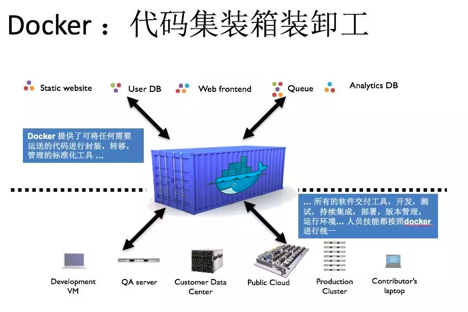
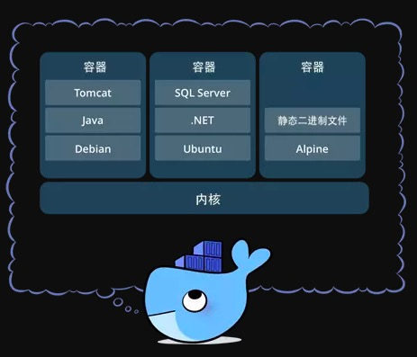
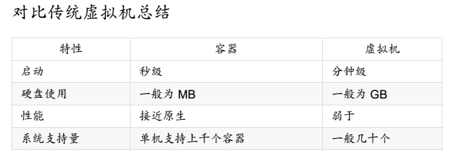

## docker是什么？
>	官方解释：Docker 是一个开源的应用容器引擎，让开发者可以打包他们的应用以及依赖包到一个可移植的容器中,然后发布到任何流行的Linux机器上,也可以实现虚拟化,容器是完全使用沙箱机制,相互之间不会有任何接口。

我理解的：docker类似集装箱,具备一些标准化的方式（比如API接口，存储方式等），主要目的是为了隔离，使进程之间相互独立，同时也便于用户管理。

&emsp;

## 为什么使用docker？

1.更高效的利用系统资源
>	由于容器不需要进行硬件虚拟及运行完整操作系统等额外开销，Docker对系统资源的利用率更高。无论是应用执行速度、内存损耗或者文件存储速度，都要比传统的虚拟机技术更高效。因此，相比虚拟机技术，一个相同配置的主机，往往可以运行更多数量的应用。

2.更快速的启动时间
>	可以做到秒级、甚至毫秒级的启动时间。大大的节约了开发、测试、部署的时间

3.一致的运行环境
>	开发过程中由于开发环境、测试环境、生产环境不一致，导致有些BUG并未在开发过程中被发现。而Docker的镜像提供了除了内核外完整的运行时环境，确保了应用运行环境得一致性。

4.持续交付和部署
>	使用Docker可以通过定制应用镜像来实现持续集成、持续交付、部署。开发人员可以通过DockerFile来进行镜像构建，并结合 持续集成系统进行集成测试，而运维人员则可以直接在生产环境中快速部署该镜像，甚至结合持续部署系统进行自动部署。

5.更轻松的迁移
>	由于Docker确保了执行环境得一致性,可以在很多平台上运行,使得应用的迁移更加容易。

6.更轻松的维护和扩展
>	Docker使应用的分层存储以及镜像的技术，使得应用重复部分的复用更为容易，也使得应用的维护更新更加简单

&emsp;

## docker的基本原理
对 Docker 项目来说，它最核心的原理实际上就是为待创建的用户进程： 

* 启用 Linux Namespace 配置；  
 * 用于隔离文件系统，进程和网络,是修改进程视图的主要方法
* 设置指定的 Cgroups 参数；
 * control group,将CPU及内存之类的资源独立分配给每个docker容器,用来制造约束的主要手段
* 切换进程的根目录（Change Root）。  
&emsp;

## docker的基本原理
对 Docker 项目来说，它最核心的原理实际上就是为待创建的用户进程： 
> 进程是一个具有独立功能的程序关于某个数据集合的一次运行活动。它可以申请和拥有系统资源，是一个动态的概念，是一个活动的实体。它不只是程序的代码，还包括当前的活动，通过程序计数器的值和处理寄存器的内容来表示。

* 启用 Linux Namespace 配置；  
 * 用于隔离文件系统，进程和网络,是修改进程视图的主要方法
* 设置指定的 Cgroups 参数；
 * (control group),将CPU及内存之类的资源独立分配给每个docker容器,用来制造约束的主要手段
* 切换进程的根目录（Change Root）。 

因此，一个正在运行的 Docker 容器，其实就是一个启用了多个Linux Namespace 的应用进程，而这个进程能够使使用的资源量，则受 Cgroups 配置的限制。

&emsp;

## docker的基本概念

### 1.镜像（Image） -- 一个特殊的文件系统
* 除了提供容器运行时所需的程序、库、资源、配置等文件外，还包含了一些为运行时准备的一些配置参数（如匿名卷、环境变量、用户等）。 
* 镜像不包含任何动态数据，其内容在构建之后也不会被改变。 
* 镜像构建时，会一层层构建，前一层是后一层的基础。每一层构建完就不会再发生改变，后一层上的任何改变只发生在自己这一层。

>挂载在容器根目录上、用来为容器进程提供隔离后执行环境的文件系统，就是所谓的“容器镜像”。它还有一个更为专业的名字，叫作：rootfs（根文件系统）。需要明确的是，rootfs 只是一个操作系统所包含的文件、配置和目录，并不包括操作系统内核。在 Linux 操作系统中，这两部分是分开存放的，操作系统只有在开机启动时才会加载指定版本的内核镜像.
>
>

### 2.容器（Container） —— 镜像运行时的实体(运行之后镜像就变成一个容器)
* 镜像和容器的关系，就像是面向对象程序设计中的类和实例一样，镜像是静态的定义，容器是镜像运行时的实体。容器可以被创建、启动、停止、删除、暂停等 。  

   
* 	容器的实质是进程，但与直接在宿主执行的进程不同，容器进程运行于属于自己的独立的 命名空间。前面讲过镜像使用的是分层存储，容器也是如此。    

* 	容器存储层的生存周期和容器一样，容器消亡时，容器存储层也随之消亡。因此，任何保存于容器存储层的信息都会随容器删除而丢失。

### 3.仓库（Repository）——集中存放镜像文件的地方
* 镜像构建完成后，可以很容易的在当前宿主上运行，但是， 如果需要在其它服务器上使用这个镜像，我们就需要一个集中的存储、分发镜像的服务，Docker Registry就是这样的服务。  
 
* 	一个仓库会包含同一个软件不同版本的镜像，而标签就常用于对应该软件的各个版本 。我们可以通过<仓库名>:<标签>的格式来指定具体是这个软件哪个版本的镜像。
> 如果不给出标签，将以 latest 作为默认标签.。

三者之间的关系

&emsp;

### 4.Docker 客户端和服务器
docker是一个客户-服务器（C/S）架构的程序，既能作为客户端，又能作为服务器端。docker客户端只需向docker服务器或守护进程发送请求，服务器或守护进程将完成所有的工作并返回结果。
