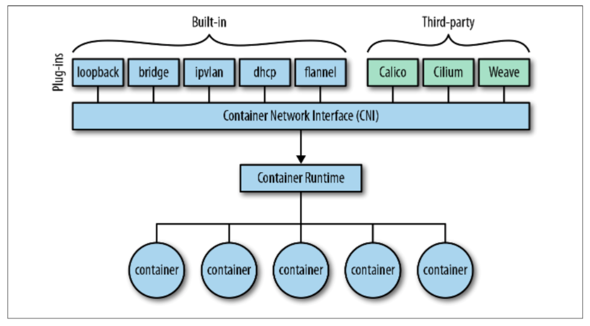

## CNI

### CNI规范

CNI(Container Network Interface) 是 google 和 CoreOS 主导制定的容器网络标准，是一个协议。这个协议连接了两个组件：容器管理系统和网络插件。它们之间通过 JSON 格式的文件进行通信，实现容器的网络功能。

CNI的目的在于定义一个标准的接口规范，使得container runtime在增删容器的时候，能够按照规范向CNI实例提供标准的输入并获取标准的输出，再将输出作为管理这个容器的网络的参考。

在满足这个输入输出以及调用标准的CNI规范下，kubernetes委托CNI实例去管理POD的网络资源并为POD建立互通能力。具体包括：创建容器网络空间（network namespace）、把网络接口（interface）放到对应的网络空间、给网络接口分配 IP 等等。

CNI插件必须实现一个可执行文件，这个文件可以被容器管理系统（例如rkt或Kubernetes）调用。

CNI插件必须实现容器网络添加，容器网络删除，报告版本信息等功能

### CNI设计考量

- 容器运行时必须在调用任何插件之前为容器创建一个新的网络命名空间。
- 运行时必须确定这个容器应属于哪个网络，并为每个网络确定哪些插件必须被执行。
- 网络配置采用JSON格式，可以很容易地存储在文件中。网络配置包括必填字段，如name和type以及插件（类型）。网络配置允许字段在调用之间改变值。为此，有一个可选的字段args，必须包含不同的信息。
- 容器运行时必须按顺序为每个网络执行相应的插件，将容器添加到每个网络中。
- 在完成容器生命周期后，运行时必须以相反的顺序执行插件（相对于执行添加容器的顺序）以将容器与网络断开连接。
- 容器运行时不能为同一容器调用并行操作，但可以为不同的容器调用并行操作。
- 容器运行时必须为容器订阅ADD和DEL操作，这样ADD后面总是跟着相应的DEL。 DEL可能跟着额外的DEL，但是，插件应该允许处理多个DEL（即插件DEL应该是幂等的）。
- 容器必须由ContainerID唯一标识。存储状态的插件应该使用（网络名称，容器ID）的主键来完成。
- 运行时不能调用同一个网络名称或容器ID执行两次ADD（没有相应的DEL）。换句话说，给定的容器ID必须只能添加到特定的网络一次。

### CNI基本思想

Container Runtime在创建容器时，先创建好network namespace，然后调用CNI插件为这个ns配置网络，其后再启动容器内的进程。

使用CNI后，容器的IP分配就变成了如下步骤：

1. kubelet 先创建pause容器生成network namespace
2. 调用网络CNI driver
3. CNI driver 根据配置调用具体的cni 插件
4. cni 插件给pause 容器配置网络
5. pod 中其他的容器都使用 pause 容器的网络

### CNI工作模型

  

从宏观上，我们来看看CNI是如何工作的

  
 

容器运行时需要一些配置并向插件发出命令。插件被调用并配置网络。
```
docker run --net=none -dt busybox

docker inspect -f {{ .State.Pid }} 9d626be0

export CNI_COMMAND=ADD

export CNI_IFNAME=eth0

export CNI_CONTAINERID=9d626be087590021d57db74a164922ad1a565830cce89e6c039ca9c2d2ea55b4

export CNI_PATH=/opt/cni/bin/

export CNI_NETNS=/proc/5705/ns/net

/opt/cni/bin/calico < /etc/cni/net.d/10-calico.conflist
```
此示例显示了如何使用特定配置（10-calico.conflist）将某个插件（calico）应用于给定容器（9d626be08）。请注意，虽然最初所有配置参数都作为环境变量传入，但现在更多的是使用（JSON）配置文件。

### CNI插件类型

基础可执行文件，按照功能分三类

#### Main插件

用来创建具体网络设备接口的二进制文件。

例如：birdge(网桥设备)、ipvlan、lookback(lo 设备)、ptp(Veth Pair设备)、macvlan、vlan

#### IPAM插件

负责分配IP地址的二进制文件。

例如：dhcp,这个文件会向dhcp服务器发起请求；host-local,则会使用预先配置的IP地址来进行分配。

#### Meta插件

拥有部分功能的插件, 必须依赖其他的 main plugin 链式使用。

例如 flannel，就是专门为Flannel项目提供的CNI插件，根据flannel的配置文件创建接口。

### CNI逻辑

#### 输入

##### 环境变量传递

调用插件的时候，这些参数会通过环境变量进行传递：

- CNI\_COMMAND：要执行的操作，可以是 ADD（把容器加入到某个网络）、DEL（把容器从某个网络中删除）
- CNI\_CONTAINERID：容器的 ID，比如 ipam 会把容器 ID 和分配的 IP 地址保存下来。可选的参数，但是推荐传递过去。需要保证在管理平台上是唯一的，如果容器被删除后可以循环使用
- CNI\_NETNS：容器的 network namespace 文件，访问这个文件可以在容器的网络 namespace 中操作
- CNI\_IFNAME：要配置的 interface 名字，比如 eth0
- CNI\_ARGS：额外的参数，是由分号;分割的键值对，比如 &quot;FOO=BAR;hello=world&quot;
- CNI\_PATH：CNI 二进制查找的路径列表，多个路径用分隔符 : 分隔

##### 标准输入传递

网络信息主要通过标准输入，作为 JSON 字符串传递给插件，必须的参数包括：

- cniVersion：CNI 标准的版本号。因为 CNI 在演化过程中，不同的版本有不同的要求
- name：网络的名字，在集群中应该保持唯一
- type：网络插件的类型，也就是 CNI 可执行文件的名称
- args：额外的信息，类型为字典
- ipMasq：是否在主机上为该网络配置 IP masquerade
- ipam：IP 分配相关的信息，类型为字典
- dns：DNS 相关的信息，类型为字典

插件接到这些数据，从输入和环境变量解析到需要的信息，根据这些信息执行程序逻辑

注：CNI配置文件中的DNS选项不会被K8S采用作为pod的dns配置，用户可在pod里设置dns

#### 输出

把结果返回给调用者，返回的结果中一般包括这些参数：

- IPs assigned to the interface：网络接口被分配的 ip，可以是 IPv4、IPv6 或者都有
- DNS 信息：包含 nameservers、domain、search domains 和其他选项的字典

### CNI选型

Kubernetes并没有规定一定使用某种网络解决方案，而只是陈述了三个基本要求：

- pod可以与所有其他pod通信而无需NAT
- 节点可以与所有pod进行通信（反之亦然），无需NAT
- 容器看到的自己的IP与其他容器看到的IP相同

Kubelet开启CNI接口
```
"--cni-bin-dir=/opt/cni/bin"

"--cni-conf-dir=/etc/cni/net.d"
```
#### Flannel

详见flannel

#### Calico

详见calico

#### MacVlan

详见macvlan
