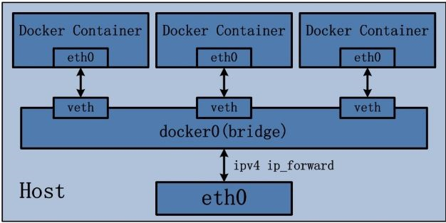
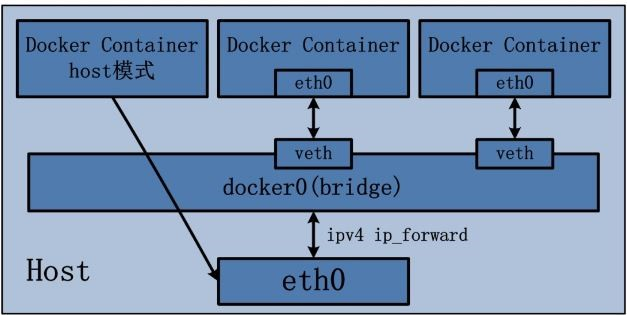
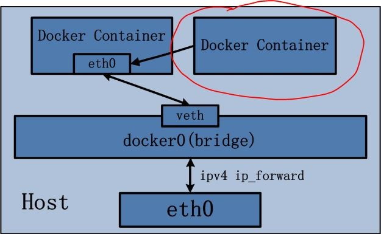
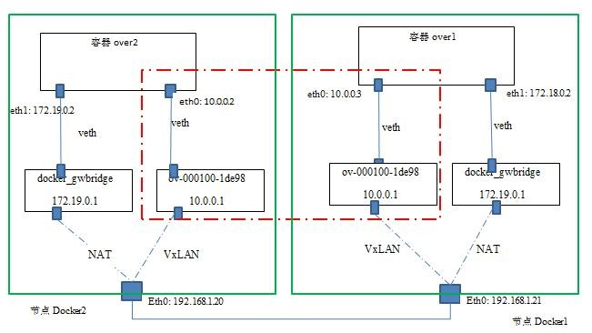

# 容器网络技术栈
  

## 低层网络层

包括网络设备，iptables，路由，IPVLAN和Linux命名空间

## 容器网络层

Docker单节点网络

Docker多节点网络

CNI

## 容器编排层

K8S网络

# Linux命名空间

## 概念

namespace 是 Linux内核用来隔离内核资源的方式。通过 namespace 可以让一些进程只能看到与自己相关的一部分资源，而另外一些进程也只能看到与它们自己相关的资源，这两拨进程根本就感觉不到对方的存在。具体的实现方式是把一个或多个进程的相关资源指定在同一个 namespace 中。

Linux namespaces 是对全局系统资源的一种封装隔离，使得处于不同 namespace 的进程拥有独立的全局系统资源，改变一个 namespace 中的系统资源只会影响当前 namespace 里的进程，对其他 namespace 中的进程没有影响。

## 用途

Linux 内核实现 namespace 的一个主要目的就是实现轻量级虚拟化(容器)服务。在同一个 namespace 下的进程可以感知彼此的变化，而对外界的进程一无所知。这样就可以让容器中的进程产生错觉，认为自己置身于一个独立的系统中，从而达到隔离的目的。也就是说 linux 内核提供的 namespace 技术为 docker 等容器技术的出现和发展提供了基础条件。

我们可以从 docker 实现者的角度考虑该如何实现一个资源隔离的容器。比如是不是可以通过 chroot 命令切换根目录的挂载点，从而隔离文件系统。为了在分布式的环境下进行通信和定位，容器必须要有独立的 IP、端口和路由等，这就需要对网络进行隔离。同时容器还需要一个独立的主机名以便在网络中标识自己。接下来还需要进程间的通信、用户权限等的隔离。最后，运行在容器中的应用需要有进程号(PID)，自然也需要与宿主机中的 PID 进行隔离。也就是说这六种隔离能力是实现一个容器的基础

## 类型

  

### IPC

用于隔离进程间通讯所需的资源（ System V IPC, POSIX message queues），PID命名空间和IPC命名空间可以组合起来用，同一个IPC名字空间内的进程可以彼此看见，允许进行交互，不同空间进程无法交互

### Network

Network Namespace为进程提供了一个完全独立的网络协议栈的视图。包括网络设备接口，IPv4和IPv6协议栈，IP路由表，防火墙规则，sockets等等。一个Network Namespace提供了一份独立的网络环境，就跟一个独立的系统一样。

### Mount

每个进程都存在于一个mount Namespace里面，mount Namespace为进程提供了一个文件层次视图。如果不设定这个flag，子进程和父进程将共享一个mount Namespace，其后子进程调用mount或umount将会影响到所有该Namespace内的进程。如果子进程在一个独立的mount Namespace里面，就可以调用mount或umount建立一份新的文件层次视图。

### PID

linux通过命名空间管理进程号，同一个进程，在不同的命名空间进程号不同！进程命名空间是一个父子结构，子空间对于父空间可见。

### User

用于隔离用户

### UTS

用于隔离主机名

### Cgroup

cgroup是为了对一组进程进行统一的资源监控和限制，包含了pid、cpu和memory这三个常用的subsystem，目前还没有被 docker 采用。相信在不久的将来各种容器也会添加对 Cgroup namespace 的支持

从版本号为 3.8 的内核开始，/proc/[pid]/ns 目录下会包含进程所属的 namespace 信息，使用下面的命令可以查看当前进程所属的 namespace 信息：

$ ll /proc/$$/ns

  
 
这些 namespace 文件都是链接文件。链接文件的内容的格式为 xxx:[inode number]。其中的 xxx 为 namespace 的类型，inode number 则用来标识一个 namespace，我们也可以把它理解为 namespace 的 ID。如果两个进程的某个 namespace 文件指向同一个链接文件，说明其相关资源在同一个 namespace中。

其次，在 /proc/[pid]/ns 里放置这些链接文件的另外一个作用是，一旦这些链接文件被打开，只要打开的文件描述符(fd)存在，那么就算该 namespace 下的所有进程都已结束，这个 namespace 也会一直存在，后续的进程还可以再加入进来。

## 操作

与命名空间相关的API主要有三个：clone，setns和unshare，这三个API都是针对一个进程来操作的

### Clone

clone方法会创建一个新的子进程，然后让子进程加入新的namespace，而当前进程保持不变。

### Setns

setns方法用于将当前进程加入到已有的namespace中。

### Unshare

unshare方法使当前进程退出指定类型的namespace，并加入到新创建的namespace（相当于创建并加入新的namespace）

# Docker网络

Docker内建了3个网络

  
 
## Docker单节点的四种网络模型

### Bridge

        通常用于在独立容器中运行的应用程序，这是默认的Docker网络模型。

        Docker守护进程创建了docker0，它是一个虚拟以太网网桥，它可以在连接到它的任何port之间自动转发数据包。 默认情况下，守护进程会通过创建一对对的网络接口将主机上的所有容器连接到此网桥，将其中一个对等端分配为容器的eth0接口，并将另一个对等端放在主机的命名空间中；以及将专用IP范围内的一个子网分配给网桥。
        
  
 
其特点如下：

- 使用一个 linux bridge，默认为 docker0
- 使用 veth 对，一头在容器的网络 namespace 中，一头在 docker0 上
- 该模式下Docker Container不具有一个公有IP，因为宿主机的IP地址与veth pair的 IP地址不在同一个网段内
- Docker采用 NAT 方式，将容器内部的服务监听的端口与宿主机的某一个端口port 进行&quot;绑定&quot;，使得宿主机以外的世界可以主动将网络报文发送至容器内部
- 外界访问容器内的服务时，需要访问宿主机的 IP 以及宿主机的端口 port
- NAT 模式由于是在三层网络上的实现手段，故肯定会影响网络的传输效率。
- 容器拥有独立、隔离的网络栈；让容器和宿主机以外的世界通过NAT建立通信

例：

  
  
启动容器test1，自动获得一个IP 172.17.0.2，和主机docker0处于同一网络，且网关为docker0

  

可以看到网桥docker0已经多了一个接口

  

在主机上看到在POSTROUTING链中做了地址伪装，MASQUERADE动作，这样容器就可以通过源地址转换NAT访问外部网络了

如果容器服务监听端口并使用-P做了映射，在主机还可以看到DNAT动作，这样外部用户就可以通过主机的映射端口访问容器内部服务

docker network inspect bridge命令可以查看bridge网络详细情况

### Host

        也用于独立容器，共享主机的网络。

该模式有效地禁用了Docker容器的网络隔离特性。容器有效地继承了主机的IP地址。这种模式比桥接模式更快，因为没有路由开销，但它将容器直接暴露给公共网络，并会带来所有安全隐患。此外作为共享主机网络命名空间的后果，您需要以某种方式管理端口的分配。

  
 
其特点包括：

- 这种模式下的容器没有隔离的 network namespace
- 容器的 IP 地址同 Docker host 的 IP 地址
- 需要注意容器中服务的端口号不能与 Docker host 上已经使用的端口号相冲突
- host 模式能够和其它模式共存

例：

  
 
启动容器test2，使用—net host指定为host网络类型，可以看到容器的IP与主机一样，容器服务监听了的80端口实际上就是在主机上监听的，外部访问容器直接使用主机IP即可，不需要NAT转换。但容器的其他信息（Pid、文件系统）等还是与主机是隔离的

docker network inspect host命令可以查看host网络详细情况

### Container

        容器会共享其他容器的网络环境，两个容器之间不存在网络隔离，而这两个容器又与宿主机以及除此之外其他的容器存在网络隔离，因此需要注意端口冲突情况，否则第二个容器将无法被启动。  Kubernetes网络使用这种模式。
        
  
 
其特点是：

- 共享同一个容器网络的所有容器的网络信息是一致，除了网络信息外，其他均继续保持隔离

例

  
 
启动容器test3，使用--network container:test1指定使用已经存在的test1容器的网络，可以看到test3容器的网络信息与test1一样，是共享的

### None

        禁用Docker端的网络支持，并允许自定义网络。

        不为 Docker 容器构造任何网络环境。一旦Docker 容器采用了none 网络模式，那么容器内部就只能使用loopback网络设备，不会再有其他的网络资源，容器只能使用127.0.0.1的本机网络。

例

  
 
启动容器test4，使用--network none放弃为容器配置网络，进入容器查看除了lo外，没有其他网络设备，容器只能使用127.0.0.1的本地网络

docker network inspect none命令可以查看none网络详细情况

## 自定义网络

### Bridge

docker network create --driver _network\_type network\_name_命令即可创建自定义网络。其中--driver后面支持的类型有三种：bridge、macvlan、overlay

docker network create my-bridge --driver bridge        #创建

docker network inspect my-bridge                        #查看详情

brctl show 可以看到新建的网桥

  

在主机上可以看到两个网桥对应的路由信息

创建容器，通过--network my-bridge加入这个网络，同处于my-bridge的容器间网络是互通的，网络信息与默认的bridge没有差别（依然SNAT出网和DNAT入网），但该网桥与其他网桥之间是不通的。这种方式适用于单节点

### Overlay

Overlay 可以使得我们将报文在 IP 报文之上再次封装，VXLAN 技术为其核心，VXLAN是将以太网报文封装成UDP报文进行隧道传输，UDP目的端口为已知端口，源端口可按流分配，标准5元组方式有利于在IP网络转发过程中进行负载分担；隔离标识采用24比特来表示；未知目的、广播、组播等网络流量均被封装为组播转发。

单机模式是无法创建overlay网络模型的，需要借助分部署存储（etcd或者编排系统），部署完etcd后需要配置docker指定etcd地址后重启docker。

创建overlay 网络（只需在一个节点执行）Docker network create -d overlay my-overlay

在两个主机分别创建容器，使用--network my-overlay加入overlay网络，可以看到容器有两块网卡，eth1为走普通NAT模式，eth0 是 overlay 网段上分配的IP地址，也就是它走的是 overlay 网络，它的 MTU 是 1450 而不是 1500。

docker 会为每个 overlay 网络创建一个独立的 network namespace，其中会有一个 linux bridge br0， veth pair 一端连接到容器中（即 eth0），另一端连接到 namespace 的 br0 上。br0 除了连接所有的 veth pair，还会连接一个 vxlan 设备，用于与其他 host 建立 vxlan tunnel。容器之间的数据就是通过这个 tunnel 通信的。

ln -s /var/run/docker/netns/ /var/run/netns

ip netns

可以看到两个 host 上有一个相同的 namespace

ip netns exec 1-625e8bbfff brctl show查看 namespace 中的 br0 上的设备

  

不同的 overlay 网络是相互隔离的。

docker 默认为 overlay 网络分配 24 位掩码的子网（10.0.0.0/24），所有主机共享这个 subnet，容器启动时会顺序从此空间分配 IP。当然我们也可以通过 --subnet 指定 IP 空间。

## Docker多节点网络方案

### 基于实现方式分为

#### 隧道

- Weave：UDP广播，本机建立新的BR，通过PCAP互通。
- Open vSwitch(OVS)：基于VxLAN和GRE协议，但是性能方面损失比较严重。
- Flannel：UDP广播，VxLan。

隧道方案在IaaS层的网络中应用也比较多，大家共识是随着节点规模的增长复杂度会提升，而且出了网络问题跟踪起来比较麻烦，大规模集群情况下这是需要考虑的一个点。

#### 路由

- Calico：基于BGP协议的路由方案，支持很细致的ACL控制，对混合云亲和度比较高。
- Macvlan：从逻辑和Kernel层来看隔离性和性能最优的方案，基于二层隔离，所以需要二层路由器支持，大多数云服务商不支持，所以混合云上比较难以实现。

### 基于网络模型分为

#### Docker Libnetwork Container Network Model(CNM)阵营

- Docker Swarm overlay
- Macvlan &amp; IP network drivers
- Calico
- Contiv（from Cisco）

Docker Libnetwork的优势就是原生，而且和Docker容器生命周期结合紧密；缺点也可以理解为是原生，被Docker&quot;绑架&quot;

#### Container Network Interface(CNI)阵营

- Kubernetes
- Weave
- Macvlan
- Flannel
- Calico
- Contiv
- Mesos CNI

兼容其他容器技术(e.g. rkt)及上层编排系统(Kuberneres &amp; Mesos)，而且社区活跃势头迅猛，Kubernetes加上CoreOS主推；缺点是非Docker原生

# K8S网络

## Pod网络与Docker网络

  

 K8S中每个Pod在创建时都是先创建一个pause容器，业务容器与pause容器使用同一个网络名称空间。docker inspect $ID 会发现业务容器的网络模式是container，而pause容器的网络模式是none，因为k8s使用了cni，具体的容器网卡、IP、路由等信息是有cni配置的

## Kubelet逻辑分析

在Pod启动前，kubelet调用createPodSandbox来创建环境，包括为Pod设置网络（例如：分配IP）等。 当PodSandbox启动后，就可以分别创建/启动/停止/移除独立的容器。为了删除Pod，kubelet会在停止和移除所有容器前先停止和移除 PodSandbox。

github.com/kubernetes/pkg/kubelet/kuberuntime/kuberuntime\_sandbox.go

func (m \*kubeGenericRuntimeManager) createPodSandbox(pod \*v1.Pod, attempt uint32) (string, string, error) {

podSandBoxID, err := m.runtimeService.RunPodSandbox(podSandboxConfig, runtimeHandler)

}

github.com/kubernetes/pkg/kubelet/dockershim/docker\_sandbox.go

func (ds \*dockerService) RunPodSandbox(ctx context.Context, r \*runtimeapi.RunPodSandboxRequest) (\*runtimeapi.RunPodSandboxResponse, error) {

err = ds.client.StartContainer(createResp.ID)

#DNS配置：通过docker inspecft查看容器信息，然后再重写容器位于宿主机的resolv文件

err = ds.network.SetUpPod(config.GetMetadata().Namespace, config.GetMetadata().Name, cID, config.Annotations, networkOptions)

}

github.com/kubernetes /pkg/kubelet/dockershim/network/plugins.go

func (pm \*PluginManager) SetUpPod(podNamespace, podName string, id kubecontainer.ContainerID, annotations, options map[string]string) error {

if err := pm.plugin.SetUpPod(podNamespace, podName, id, annotations, options); err != nil {

}

#调用plugin的SetUpPod方法，这里plugin是一个interface, 具体使用哪个plugin是由kubelet的启动参数–network-plugin决定的，我们配置的是cni

}

github.com/kubernetes/pkg/kubelet/dockershim/network/cni/cni.go

获取配置文件

func getDefaultCNINetwork(confDir string, binDirs []string) (\*cniNetwork, error) {

 files, err := libcni.ConfFiles(confDir, []string{&quot;.conf&quot;, &quot;.conflist&quot;, &quot;.json&quot;})

switch {

case err != nil:

        return nil, err

case len(files) == 0:

        return nil, fmt.Errorf(&quot;No networks found in %s&quot;, confDir)

}

sort.Strings(files)

}

配置pause容器的eth0接口的网络

func (plugin \*cniNetworkPlugin) SetUpPod(namespace string, name string, id kubecontainer.ContainerID, annotations, options map[string]string) error {

 \_, err = plugin.addToNetwork(plugin.getDefaultNetwork(), name, namespace, id, netnsPath, annotations, options)

}

func (plugin \*cniNetworkPlugin) addToNetwork(network \*cniNetwork, podName string, podNamespace string, podSandboxID kubecontainer.ContainerID, podNetnsPath string, annotations, options map[string]string) (cnitypes.Result, error) {

 res, err := cniNet.AddNetworkList(netConf, rt)

}

func (c \*CNIConfig) AddNetworkList(list \*NetworkConfigList, rt \*RuntimeConf) (types.Result, error) {

 prevResult, err = invoke.ExecPluginWithResult(pluginPath, newConf.Bytes, c.args(&quot;ADD&quot;, rt))

}

该函数会遍历plugin，根据cni的type在binDir中找到同名插件，返回该插件的全路径。最后执行ExecPluginWithResult函数，它将调用cni的二进制文件并传入newConf参数以及RuntimeConf和一个ADD参数，其中ADD代表给容器添加网络。

分析到这，kubelet的网络配置已经完成了，我们最终会看到kubelet在生成新pod的时候会先生成一个sandbox容器（pause），kubelet会根据pod的yaml信息和kubelet的cni参数配置生成一个cni runtime配置，最后调用cni插件完成docker容器的网络配置。

## CNI

### CNI规范

CNI(Container Network Interface) 是 google 和 CoreOS 主导制定的容器网络标准，是一个协议。这个协议连接了两个组件：容器管理系统和网络插件。它们之间通过 JSON 格式的文件进行通信，实现容器的网络功能。

CNI的目的在于定义一个标准的接口规范，使得container runtime在增删容器的时候，能够按照规范向CNI实例提供标准的输入并获取标准的输出，再将输出作为管理这个容器的网络的参考。

在满足这个输入输出以及调用标准的CNI规范下，kubernetes委托CNI实例去管理POD的网络资源并为POD建立互通能力。具体包括：创建容器网络空间（network namespace）、把网络接口（interface）放到对应的网络空间、给网络接口分配 IP 等等。

CNI插件必须实现一个可执行文件，这个文件可以被容器管理系统（例如rkt或Kubernetes）调用。

CNI插件必须实现容器网络添加，容器网络删除，报告版本信息等功能

### CNI设计考量

- 容器运行时必须在调用任何插件之前为容器创建一个新的网络命名空间。
- 运行时必须确定这个容器应属于哪个网络，并为每个网络确定哪些插件必须被执行。
- 网络配置采用JSON格式，可以很容易地存储在文件中。网络配置包括必填字段，如name和type以及插件（类型）。网络配置允许字段在调用之间改变值。为此，有一个可选的字段args，必须包含不同的信息。
- 容器运行时必须按顺序为每个网络执行相应的插件，将容器添加到每个网络中。
- 在完成容器生命周期后，运行时必须以相反的顺序执行插件（相对于执行添加容器的顺序）以将容器与网络断开连接。
- 容器运行时不能为同一容器调用并行操作，但可以为不同的容器调用并行操作。
- 容器运行时必须为容器订阅ADD和DEL操作，这样ADD后面总是跟着相应的DEL。 DEL可能跟着额外的DEL，但是，插件应该允许处理多个DEL（即插件DEL应该是幂等的）。
- 容器必须由ContainerID唯一标识。存储状态的插件应该使用（网络名称，容器ID）的主键来完成。
- 运行时不能调用同一个网络名称或容器ID执行两次ADD（没有相应的DEL）。换句话说，给定的容器ID必须只能添加到特定的网络一次。

### CNI基本思想

Container Runtime在创建容器时，先创建好network namespace，然后调用CNI插件为这个ns配置网络，其后再启动容器内的进程。

使用CNI后，容器的IP分配就变成了如下步骤：

1. kubelet 先创建pause容器生成network namespace
2. 调用网络CNI driver
3. CNI driver 根据配置调用具体的cni 插件
4. cni 插件给pause 容器配置网络
5. pod 中其他的容器都使用 pause 容器的网络

### CNI工作模型

  

从宏观上，我们来看看CNI是如何工作的

  
 

容器运行时需要一些配置并向插件发出命令。插件被调用并配置网络。

docker run --net=none -dt busybox

docker inspect -f &#39;{{ .State.Pid }}&#39;  9d626be0

export CNI\_COMMAND=ADD

export CNI\_IFNAME=eth0

export CNI\_CONTAINERID=9d626be087590021d57db74a164922ad1a565830cce89e6c039ca9c2d2ea55b4

export CNI\_PATH=/opt/cni/bin/

export CNI\_NETNS=/proc/5705/ns/net

/opt/cni/bin/calico \&lt; /etc/cni/net.d/10-calico.conflist

此示例显示了如何使用特定配置（10-calico.conflist）将某个插件（calico）应用于给定容器（9d626be08）。请注意，虽然最初所有配置参数都作为环境变量传入，但现在更多的是使用（JSON）配置文件。

### CNI插件类型

基础可执行文件，按照功能分三类

#### Main插件

用来创建具体网络设备接口的二进制文件。

例如：birdge(网桥设备)、ipvlan、lookback(lo 设备)、ptp(Veth Pair设备)、macvlan、vlan

#### IPAM插件

负责分配IP地址的二进制文件。

例如：dhcp,这个文件会向dhcp服务器发起请求；host-local,则会使用预先配置的IP地址来进行分配。

#### Meta插件

拥有部分功能的插件, 必须依赖其他的 main plugin 链式使用。

例如 flannel，就是专门为Flannel项目提供的CNI插件，根据flannel的配置文件创建接口。

### CNI逻辑

#### 输入

##### 环境变量传递

调用插件的时候，这些参数会通过环境变量进行传递：

- CNI\_COMMAND：要执行的操作，可以是 ADD（把容器加入到某个网络）、DEL（把容器从某个网络中删除）
- CNI\_CONTAINERID：容器的 ID，比如 ipam 会把容器 ID 和分配的 IP 地址保存下来。可选的参数，但是推荐传递过去。需要保证在管理平台上是唯一的，如果容器被删除后可以循环使用
- CNI\_NETNS：容器的 network namespace 文件，访问这个文件可以在容器的网络 namespace 中操作
- CNI\_IFNAME：要配置的 interface 名字，比如 eth0
- CNI\_ARGS：额外的参数，是由分号;分割的键值对，比如 &quot;FOO=BAR;hello=world&quot;
- CNI\_PATH：CNI 二进制查找的路径列表，多个路径用分隔符 : 分隔

##### 标准输入传递

网络信息主要通过标准输入，作为 JSON 字符串传递给插件，必须的参数包括：

- cniVersion：CNI 标准的版本号。因为 CNI 在演化过程中，不同的版本有不同的要求
- name：网络的名字，在集群中应该保持唯一
- type：网络插件的类型，也就是 CNI 可执行文件的名称
- args：额外的信息，类型为字典
- ipMasq：是否在主机上为该网络配置 IP masquerade
- ipam：IP 分配相关的信息，类型为字典
- dns：DNS 相关的信息，类型为字典

插件接到这些数据，从输入和环境变量解析到需要的信息，根据这些信息执行程序逻辑

注：CNI配置文件中的DNS选项不会被K8S采用作为pod的dns配置，用户可在pod里设置dns

#### 输出

把结果返回给调用者，返回的结果中一般包括这些参数：

- IPs assigned to the interface：网络接口被分配的 ip，可以是 IPv4、IPv6 或者都有
- DNS 信息：包含 nameservers、domain、search domains 和其他选项的字典

### CNI选型

Kubernetes并没有规定一定使用某种网络解决方案，而只是陈述了三个基本要求：

- pod可以与所有其他pod通信而无需NAT
- 节点可以与所有pod进行通信（反之亦然），无需NAT
- 容器看到的自己的IP与其他容器看到的IP相同

Kubelet开启CNI接口

&quot;--cni-bin-dir=/opt/cni/bin&quot;,

&quot;--cni-conf-dir=/etc/cni/net.d&quot;

#### Flannel

详见flannel

#### Calico

详见calico

#### MacVlan

详见macvlan
