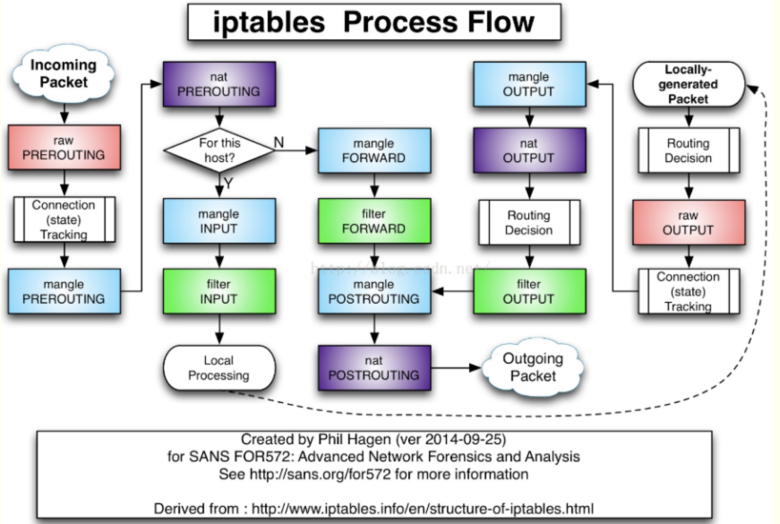

# iptables基础
规则（rules）其实就是网络管理员预定义的条件，规则一般的定义为“如果数据包头符合这样的条件，就这样处理这个数据包”。规则存储在内核空间的信息包过滤表中，这些规则分别指定了源地址、目的地址、传输协议（如TCP、UDP、ICMP）和服务类型（如HTTP、FTP和SMTP）等。当数据包与规则匹配时，iptables就根据规则所定义的方法来处理这些数据包，如放行（accept）、拒绝（reject）和丢弃（drop）等。配置防火墙的主要工作就是添加、修改和删除这些规则。
# 实现原理
Linux上防火墙实际是通过内核的netfilter来实现的，iptables和firewalld仅仅是一个维护和管理工具。

在CentOS7上，执行systemctl stop firewalld后，并不会禁用netfilter功能，也就是说，数据包的匹配过滤仍然进行，只是会清空规则。此时通过iptables -S会看到，INPUT、FORWARD、OUTPUT链策略均为ACCEPT，即全部放行

# 五条链
* PREROUTING 链：数据包进入路由之前，可以在此处进行 DNAT；_所有的数据包进来的时侯都先由这个链处理_
* INPUT 链：一般处理本地进程的数据包，目的地址为本机；
* FORWARD 链：一般处理转发到其他机器或者 network namespace 的数据包；
* OUTPUT 链：原地址为本机，向外发送，一般处理本地进程的输出数据包；
* POSTROUTING 链：发送到网卡之前，可以在此处进行 SNAT；_所有的数据包出来的时侯都先由这个链处理_ 

# 五张表
## filter
用途：用于控制到达某条链上的数据包是继续放行、直接丢弃(drop)还是拒绝(reject)

三个链：INPUT、FORWARD、OUTPUT

内核模块
iptables_filter
## nat 表
用途：network address translation 网络地址转换，用于修改数据包的源地址和目的地址

三个链：PREROUTING、POSTROUTING、OUTPUT

内核模块：iptable_nat 
## mangle
用途：用于修改数据包的 IP 头信息

五个链：PREROUTING、POSTROUTING、INPUT、OUTPUT、FORWARD

内核模块：iptable_mangle 
## raw 
用途：iptables 是有状态的，其对数据包有链接追踪机制，连接追踪信息在 /proc/net/nf_conntrack 中可以看到记录，而 raw 是用来去除链接追踪机制的

两个链：OUTPUT、PREROUTING

内核模块：iptable_raw 
## security 
最不常用的表，用在 SELinux 上

# 流程
这五张表是对 iptables 所有规则的逻辑集群且是有顺序的，当数据包到达某一条链时会按表的顺序进行处理，表的优先级为：raw、mangle、nat、filter、security。

iptables 的工作流程如下图所示
  

# 动作
* accept:接收数据包，跳往下一个chain
* reject:拦阻，并通过发送方，中止
* drop:丢弃数据包，中止
* redirect:重定向、映射、透明代理，将包导向到另一个端口PNAT，继续
* snat:源地址转换，跳往下一个chain
* dnat:目标地址转换，跳往下一个chain
* masquerade:ip伪装(NAT)，改写包源IP，跳往下一个chain
* log:记录日志，继续
* mirror:对调源IP和目的IP，中止
* queue:将包交给其他程序处理，中止
* return:结束当前，返回主链，适用于自定义链，返回
* mark:染色，继续

# 命令
## 格式
iptables -t 表名 <-A/I/D/R> 规则链名 [规则号] <-i/o 网卡名> -p 协议名 <-s 源IP/源子网> --sport 源端口 <-d 目标IP/目标子网> --dport 目标端口 -j 动作

## 参数
* -A/--append chain，向规则链末尾追加
* -D/--delete chain，-D/--delete chain rulenum，删除链中某条规则（规则编号从1开始）
* -I/--insert chain [rulenum]，插入规则
* -R/--replace chain rulenum，替换规则
* -L/--list [chain [rulenum]]，列出规则，按chain区分
* -S/--list-rules [chain [rulenum]]，列出规则，命令格式
* -F/--flush [chain]，清空全部[指定链]
* -Z/--zero [chain [rulenum]]，重置计数器
* -N/--new chain，创建自定义链
* -X/--delete-chain [chain]，删除自定义链
* -P/--policy target，修改默认策略
* -E/--rename-chain old-chain new-chain，重命名

##  选项
* -4/--ipv4 -6/--ipv6
* -p/--protocol proto，协议类型
* -s/--source address[/mask][...]，源IP
* -d/--destination adress[/mask][...]，目的IP
* -i/--in-interface，网卡进
* -o/--out-interface，网卡出
* -j/--jump target，跳转
* -g/--goto chain，转到链，不return
* -m/--match match，使用扩展
* -n/--numeric ，数字方式显示
* -t/--table table，表名，默认filter
* -v/--verbose，详情模式
* -x/--exact，显示精确值

## 常用命令
### 清除iptables
iptables -F #清空规则

iptables -X #删除自定义链

iptables -Z #重置计数器
### 查看规则
iptables -L -n -v  #-v会显示包和数据大小数据

iptables -L -n --line-numbers  #显示规则序号
### 查看net表规则
iptables -S -t nat
### 显示扩展帮助信息
iptables -m addrtype --help
### 保存规则
iptables-save #会打印到屏幕上

iptables-save > /etc/iptables/iptables.rules #保存到文件中

iptables-restore < /etc/iptables/iptables.rules #恢复
### 添加规则
iptables -A INPUT -p tcp --dport 22 -j ACCEPT #允许访问22端口

iptables -I INPUT 1 -p tcp --sport 80 -j ACCEPT # 将此规则添加到指定位置

> 规则默认是有优先顺序的，默认是插入到最后，使用-I可以添加到指定位置
