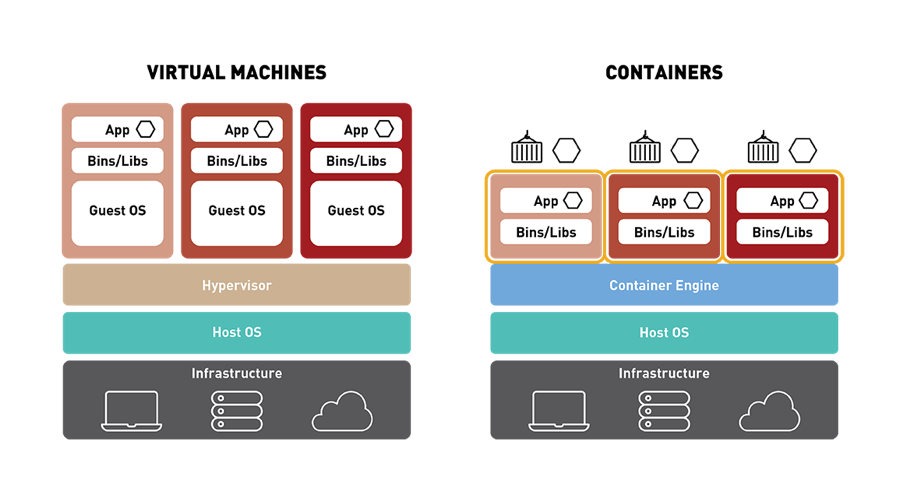
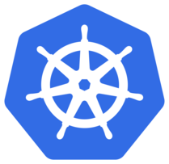

# 新的时代
1. 基于vm虚拟化的云，对应用的开发，部署以及运维基本没有带来变化
2. 商业模式要求所有的应用都实现快速迭代, 支持更多的设备，更多的用户
3. 微服务已经成为复杂系统的基本架构，并导致了devops的流行
4. 容器云，极大的改变的应用的各个方面，云原生的应用大量涌现成为微服务开发和运维的标准

# 容器，容器云

1. 云代表资源共享，调度和伸缩
2. 和虚拟机不同，容器云调度和管理的是企业的应用
3. 容器定义了企业应用交付和运行的标准

# 容器云 vs OpenStack
1. 容器 vs VM
  + 计算资源的高效利用
  + 运行环境管理和隔离
2. 平台提供应用的高可用
  + 应用定义好健康的标准
  + 应用崩溃或处于不健康状态，平台会自动重启应用
  + 应用不需要任何多余编码
3. 基于应用的调度和水平扩展
  + 基于资源的调度
  + 基于应用亲和性的调度
  + 基于特殊资源需要的调度
    
# kubernetes

1. 2014由google开源
2. 希腊语，航海员
3. Borg项目，基于google15年容器云经验
4. 核心3大优势
  + 高可用和自我修复能力
  + 可扩展性，从调度，网络到存储，几乎所有的模块和功能都
    能在不修改核心代码的情况下定制
  + 兼容性，可以在目前所有的私有和公有云上运行

# devops
1. 交付物从开发可执行程序和库变成容器镜像
2. 定义好自己需要的网络和存储
3. 部署到测试环境测试
4. 部署到运行环境提供线上服务
5. 开发，测试，运维在一个team里
6. 开发->测试->部署成为常态

# zcloud的核心功能

1. 容器云的搭建
2. 容器云的管理
3. 多集群管理和跨集群支持
4. 混合云支持

# zcloud & kubernetes
1. k8s的自动化搭建, k8s完整方案的集成和专业维护
2. k8s的简化运维和管理
3. k8s的功能增强和补充
4. 多k8s集群管理，包括公有云上的k8s集群

## 容器云的完整方案（k8s发行版本）
1. k8s是操作系统的内核(linux kernel)
2. zcloud = k8s + GUI + 网络 + 存储 (centos, ubuntu)

## k8s简介
1. 用户声明想要部署的服务
2. 声明中包含
  * 应用的容器镜像和个数
  * 应用的配置
  * 应用对计算资源的要求
  * 应用对存储资源的要求
  * 应用对网络的要求
3. k8s调度器根据需求把应用调度到某个主机上
4. 为每个容器分配地址
5. 为容器挂载需要的存储
6. 创建ip table和dns资源记录，让其他服务通过访问一个虚拟地址，来访问应用
7. 不断监控应用的状态，保证应用的高可用
  * 重启应用
  * 将应用调度到其他节点上
  * 修改ip table的规则，保证应用对应的虚拟地址，总能访问到最新的容器

## zcloud核心功能
1. k8s资源管理
2. 集群自动搭建，节点管理，集群升级
3. 后台事件，集群shell，容器shell和日志
4. 基于名字空间的权限管理
5. 服务总览
6. 存储和网络总览
7. 本地镜像仓库
8. 系统和应用的性能指标监控展示和告警
9. 支持nfs, ceph
10. 配置自动同步
11. 本地存储自动化配置
  * 动态创建
  * 支持分区域和存储介质
12. 跨集群的服务发现
13. 集群安全
  * k8s的安全加固
  * 容器配额
  * 系统权限的展示跟踪
